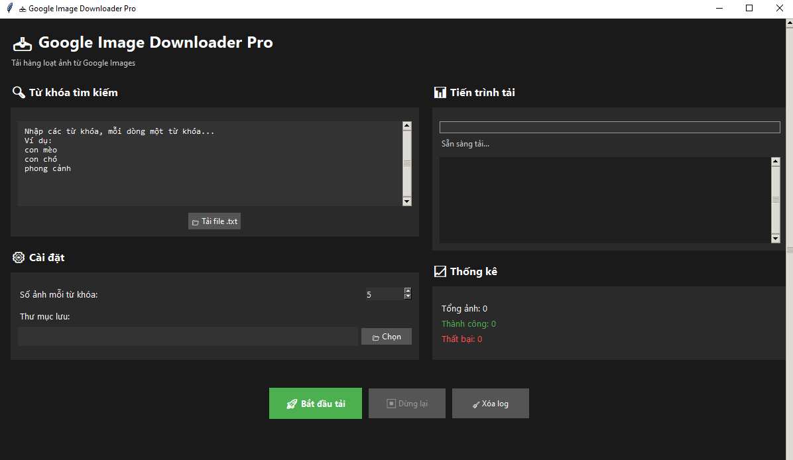

---

## 📥 Google Image Downloader Pro

Một công cụ GUI mạnh mẽ cho phép người dùng **tìm kiếm và tải hàng loạt ảnh chất lượng cao từ Google Images** chỉ bằng vài cú nhấp chuột.

---

###  Tính năng nổi bật

* ✅ Giao diện đồ họa trực quan, hiện đại (Dark Mode).
* ✅ Cho phép **dán từ khóa trực tiếp** hoặc **tải từ file `.txt`**.
* ✅ Chọn **số lượng ảnh mỗi từ khóa** (tối đa 20 ảnh).
* ✅ Hỗ trợ định dạng ảnh `.jpeg`, `.jpg`, `.png`.
* ✅ Lưu ảnh tự động về thư mục bạn chọn.
* ✅ Hiển thị tiến trình tải, log chi tiết và thống kê ảnh thành công / thất bại.
* ✅ Không bị "treo" giao diện khi đang tải (sử dụng đa luồng).

---

###  Yêu cầu hệ thống

* Python 3.7+
* Các thư viện sau:

  ```bash
  pip install pillow requests
  ```

---

###  Cách sử dụng

#### 1. Chạy chương trình:

```bash
python image_downloader.py
```

#### 2. Trong giao diện:

* Nhập từ khóa vào ô bên trái (hoặc bấm **📁 Tải file .txt**).
* Chọn số ảnh cần tải và thư mục lưu ảnh.
* Bấm nút **🚀 Bắt đầu tải**.

---

###  Ví dụ file từ khóa (`keywords.txt`):

```
con mèo
phong cảnh núi
tranh vẽ anime
```

---

### ⚙️ Cấu hình Google API (bắt buộc)

Để sử dụng được chương trình, bạn cần có:

* `Google Custom Search API Key`
* `Search Engine ID (CX)`

Bạn có thể lấy miễn phí tại:

* [https://programmablesearchengine.google.com/](https://programmablesearchengine.google.com/)
* [https://console.cloud.google.com/apis](https://console.cloud.google.com/apis)

>  Điền `API_KEY` và `CX` vào đầu file `image_downloader.py` trước khi sử dụng.

---

### 🛠 Đóng gói sang file `.exe` (Windows)

Nếu muốn tạo 1 file chạy duy nhất:

```bash
pip install pyinstaller
pyinstaller --onefile --noconsole image_downloader.py
```

File `.exe` sẽ nằm trong thư mục `dist/`.

---

###  Giao diện mẫu

> **

---

### 📄 Giấy phép

MIT License – Sử dụng tự do cho mục đích cá nhân hoặc thương mại.

---


